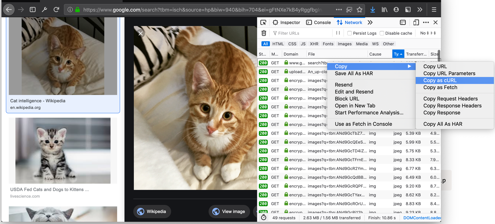
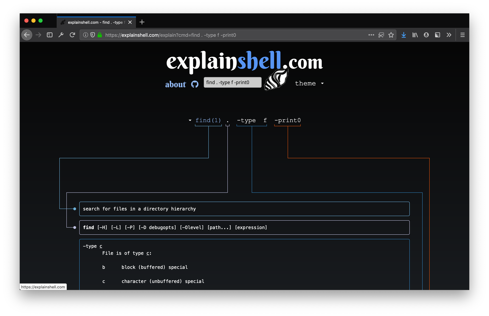

# Useful shell commands & resources

As much for my reference as for anyone else, these are some commands I found useful for class and work.

## File transfers & requests

### cURL

#### Download with cookies

In the web browser dev tools, right click a request and copy as cURL. Paste into terminal to download the file with the necessary auth.

#### POST with payload & auth

`bash$!$ curl -X POST -H "Content-Type: application/json" -d '{"title": "Hello", "excerpt" : "World"}' http://0.0.0.0:5000/api/endpoint --user johndoe:passwd123`

### Resumable downloads with rsync

Useful for large downloads with a spotty internet connection.

`bash$!$ rsync -P -e ssh username:password@remote.server.com:/path/to/file.zip ~/Downloads/file.zip`

## Debugging

### Valgrind with all the goodies

`bash$!$ valgrind --track-origins=yes --tool=memcheck --leak-check=yes --leak-check=full --show-leak-kinds=all -q -v ./path/to/executable`

## Documentation

-   [Explain Shell](https://explainshell.com/): A more powerful `man` page that visually breaks down each shell command.

