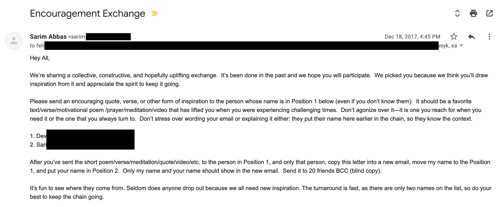
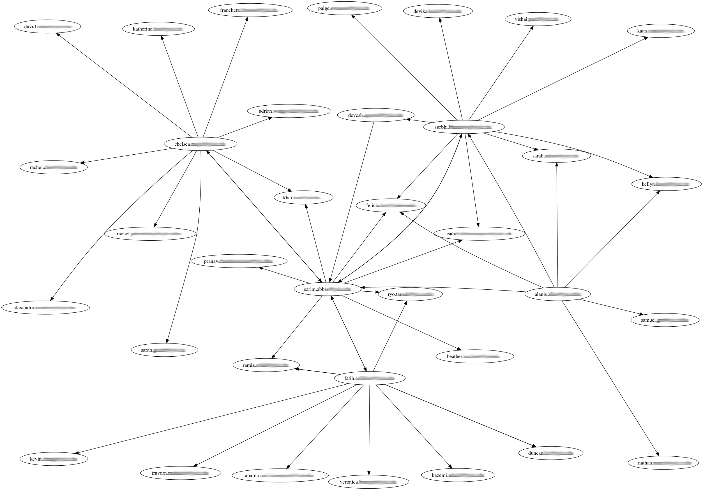
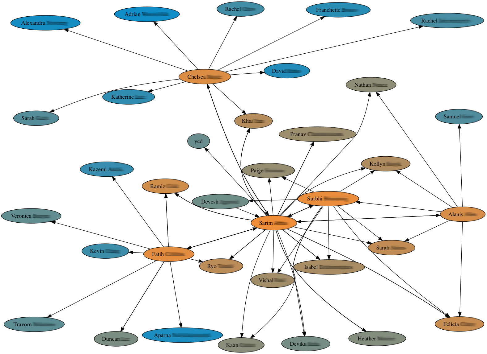

# Visualizing a social network from an email chain

[[toc]]

## Introduction

Email messages, particularly chained emails, are interestingly amenable to social network analysis. Ever been part of an email chain? During exam season, it’s pretty common for many students to receive emails like these:



These emails are interesting because they are rich in data about who we tend to contact frequently, and how groups of people are connected. Could using this data and graphing these relationships allow us to make inferences about well-connected people, social butterflies and degrees of separation?

To test this, I set up a script that accesses email messages under a label in a Gmail account. Using Gmail’s API, it looks at each message’s payload header to see who is sending and receiving these messages. Email addresses are unique, and are gathered into an adjacency list representation that keeps track of everyone a node/person has ever interacted with in these emails, as well as overall degree for that node. This simple representation is eventually rendered into a directed graph.

## Process

What does this look like in Python? Here is the overview:

```python
# authenticate...
service = discovery.build('gmail', 'v1', http=http)

# get messages
messages = ListMessagesMatchingQuery(service, 'me', 'label:networkexperiment')
# ...

# explore headers
header_graph = headerExplore(messages, service, 'me')

# render graph
digraphRender(header_graph, 'png')
```

### 1. Getting data

The first obstacle is to transform header data into an adjacency list. In Python, an adjacency “dict” is a little more convenient, with email addresses as keys.

```json
{
    "sender": "sarim@domain.com"
    {
        "name": "Sarim Abbas",
        "indegree": 5,
        "outdegree": 2,
        "receivers":["jane.doe@domain.com", "john.doe@domain.com"]
    }
}
```

Since email headers tend to be pretty inconsistent in formatting, using a regular expression to grab the email address and then generating a name based on the address is fairly useful. This can avoid duplicates and/or garbage data.

### 2. Rendering graph

The bigger challenge is rendering the graph. For this, the Graphviz Python API is very handy. Using DOT language, it allows for the creation of graph objects (easy with an existing adjacency list representation), and outputs the graphic to a file. But it can take some tweaking to get the results right.

By looking at just six of these emails, I was able to construct a rudimentary directed graph, which was surprisingly accurate in that it confirmed my intuitions about my friend circle and its socially active members.


After cleaning up duplicates and experimenting with a [force-directed](https://en.wikipedia.org/wiki/Force-directed_graph_drawing) engine, I was able to get a much better result:



How can we make this even better? Since we know something about the total degree of each node, the nodes can be ordered by color. Using RGB interpolation, I was able to create a kind of heat-map, and make highly-connected nodes even more apparent.



That’s about it!

## Improvements

Such a graph can help us intuit about our friendships and associations, but with a limited dataset, and by its nature, the algorithm will always overemphasize the role of the self. By collecting more data from friends (get their permission!) or by having a means to track where a forwarded email ends up (like [Boomerang](https://www.boomeranggmail.com/); probably unethical), it may be possible to construct a larger and more accurate graph.

From nested email chains, an additional source of data is the body text of the email itself. With repeated forwarding, previous email addresses are collapsed into the body rather than the header. A regular expression here, along with some logic to categorize the senders and receivers, can help pull these emails.

However, the more data is collected, the more cluttered the graph becomes. To keep things clean, only nodes that meet a certain degree threshold can be included in the graph, and stragglers can be removed. Alternatively, all found nodes can be included, but especially well-connected nodes can retain labels.

I’ve colored the graph using a linear interpolation from a start to end RGB color. But it could be useful to start from two opposite colors and meet somewhere in the middle. One color extreme could represent maximum out-degree, and the other extreme could represent maximum in-degree. This may help isolate “givers” and “takers” in this network.
