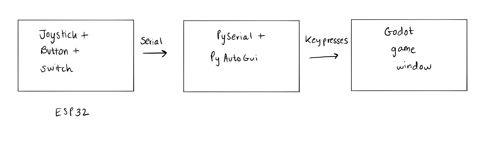

# Building a game controller with an ESP32

> This post references [my GitHub repo](https://github.com/sarimabbas/sarim-cs334/tree/master/2_interactive_devices/2_performance_device), which has source code and schematics.

## Introduction

Some microcontrollers (such as the Arduino Micro) can act as HID devices and appear as generic game controllers to a computer. If you've got one of those, you might want to see [this Instructable first](https://www.instructables.com/id/Arduino-LeonardoMicro-as-Game-ControllerJoystick/).

So for my particular use-case (which was creating a game controller for a custom video game), the challenge was how to convincingly emulate a game controller over serial.

> The ESP32 cannot act as an HID device over serial, but _can_ over BLE ([example library](https://github.com/wolfeidau/esp32-hid-joystick)), although most implementations use ESP-IDF and not the Arduino Core.

## Emulating with software

First, we must send raw sensor data over serial to a script on a host computer. Then, we have two options. One is to emulate a virtual HID device, but libraries are few. The second is to emulate keypresses, which has much better support. Here is an illustration of the data flow:

1. Off-the-shelf hardware such as a push button or a joystick are read by the ESP32. It debounces sensor input and transmits it over serial (or even WiFi or Bluetooth) to the host computer.
2. The computer runs a background process to read the ESP32 data and transform it into virtual keypresses. With Python, PySerial is a library used to read serial data, and PyAutoGui is used to send keypresses.
3. The keypresses are sent to the game.

I have example code [on GitHub here](https://github.com/sarimabbas/sarim-cs334/tree/master/2_interactive_devices/2_performance_device). The `src/esp32_controller` directory shows how to read and send sensor data for my particular use case. The `src/serial_interface` directory is the important piece, which translates that data into virtual keypresses.

## The finished controller

My own controller consists of a 3D-printed case from Thingiverse, stuffed (with much difficulty!) with the ESP32, a joystick, a push button, a toggle switch and a piece of breadboard. The components are held together with liberal amounts of hot glue.

The setup works really well with minimal latency, and in this (exaggerated) video you can see it in action:

<YouTube src="https://www.youtube-nocookie.com/embed/MQxkPw-gNHw"/>

## Extensions

To make the controller more portable, I created a version which transmits data over WiFi and is battery operated. The GitHub repo for that [can be found here](https://github.com/sarimabbas/sarim-cs334/tree/master/3_going_wireless).

It might also be worth going back to the HID route and seeing if emulating HID in software can reduce the code required and solve one of the frustrating problems of emulating keypresses: it affects any app that has its windows in focus.
