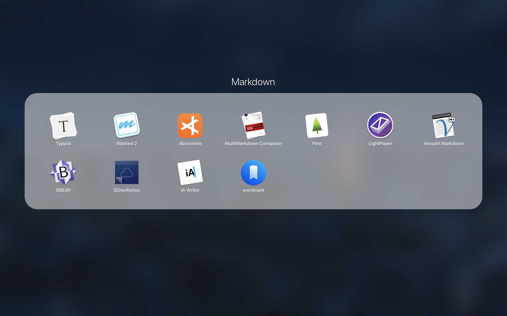
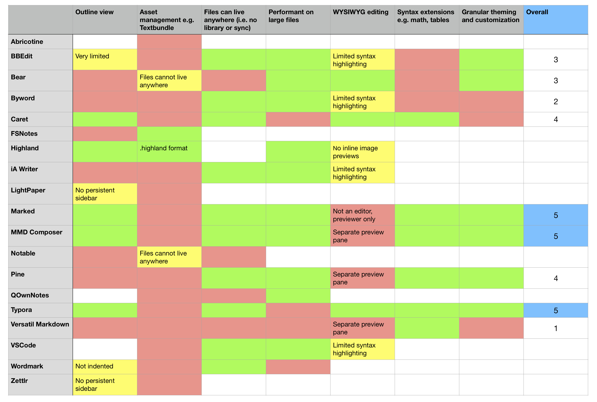
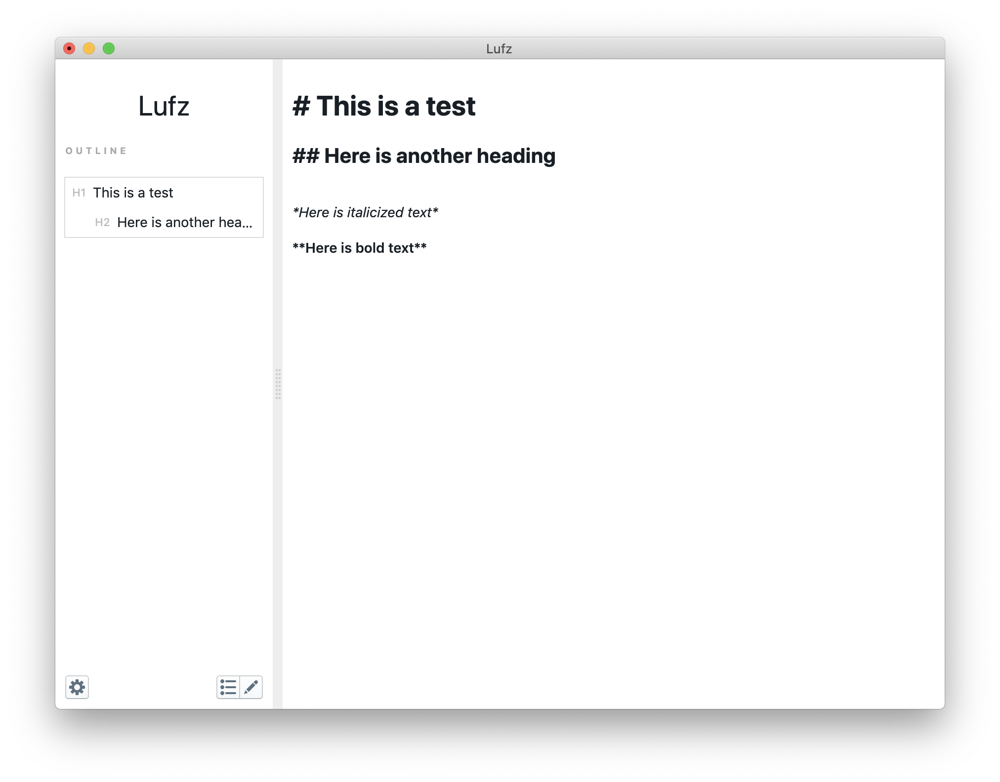

# Designing a new Markdown editor

[[toc]]

## Introduction

I keep a small diary to brainstorm ideas and improvements for products. _Design Log_ is meant to develop my scribbles into mature concepts, for my own benefit and to share with others.

This post is about Markdown. Markdown is a lightweight markup language used to write web pages, articles, novels, technical documentation and more. Markup languages let you apply formatting to otherwise plain-text when rendered. For instance, asterisks produce bold text: (\*example\* --> **example**). Some Markdown syntax has already been incorporated into mainstream products such as Messenger and Slack, so you might already be using it. You can try Markdown by visiting [StackEdit](https://stackedit.io/), an online editor.

Markdown editing apps are like MS Word - they provide features that make working with Markdown more pleasant. These might include syntax highlighting, inline preview of images or a detailed grammar analysis. I've tried over a dozen of these apps. In the rest of this post, I'll systematically propose my own design for a new Markdown editor.

## Users

Markdown first saw widespread adoption by coders. It is used commonly in READMEs, API docs, leaving comments etc. Over time, Markdown's value was recognized by other professions like playwrights, novelists and students. [Ulysses](https://ulysses.app/) and [Highland](https://quoteunquoteapps.com/highland-2/), for instance, have feature sets that cater primarily to longform writers. [Bear](https://bear.app/), on the other hand, is meant for more casual note-taking.

Here are some possible classes of users, listed:

-   Authors
-   Email users
-   Programmers
-   Students (and other academics)

### Students

As a student myself, I am particularly excited about productivity apps that can improve my class performance. Markdown editing apps can help me write notes quickly, organize complex ideas and share them with others. While these apps might be similar to other word processing apps at first glance, as a CS major I find the idea of working with plaintext more appealing. Like code, plaintext is transparent and easy to manipulate - a massive Word doc is not.

In the rest of this post, I will delineate the design of a Markdown editor that can best serve students.

|                                                               |                                                                                                                                                                                                    |
| ------------------------------------------------------------- | -------------------------------------------------------------------------------------------------------------------------------------------------------------------------------------------------- |
| Me, a STEM student                                            | Behaviors:<ul><li>Writes copious amounts of notes (200 pages per course)</li><li>Uses formulae and diagrams interspersed in text</li><li>Synthesizes information from multiple documents</li></ul> |
| Demographics:<ul><li>In 20s</li><li>College student</li></ul> | Goals:<ul><li>Be able to review information at a glance</li><li>Work with large amounts of information at once</li><li>Stay organized</li><li>Share work with others</li> </ul>                    |

## Stories

Two use cases are essential to me:

1. Organize work: I want to unify and sort my notes into a meaningful structure, so that they are easier to review in the future.
2. Get feedback: I want realtime feedback on my work to reduce the number of iterations needed for visual, syntactical or semantic corrections. In other words, I want to write Markdown quickly and correctly.

## Essential features

I researched over a dozen Markdown editing apps, and compiled a list of common features that most directly help with the above use cases.

These common features are as follows. After using these apps to take class notes and study for an exam, I ordered the features in terms of their importance in meeting the use cases.

| #   | Feature                           | Description                                                                                                                                 | Task          |
| --- | --------------------------------- | ------------------------------------------------------------------------------------------------------------------------------------------- | ------------- |
| 1   | Outline view                      | Usually an indented sidebar. This provides an eagle-eye view of the document's structure                                                    | Organize work |
| 2   | Special file format for assets    | Some apps adopt specialized bundle formats such as `.highland` or `.textbundle` to improve management of external assets such as images     | Organize work |
| 3   | No lock-in                        | Unlike some apps that use an isolated subset of the filesystem or a synced service, others empower users to store documents where they wish | Organize work |
| 4   | Native or near-native performance | This is key for handling large documents with hundreds of assets                                                                            | Organize work |
| 5   | WYSIWYG                           | "What You See Is What You Get". The editor pane is also the preview. This is most analogous to MS Word                                      | Get feedback  |
| 6   | Syntax extensions                 | Markdown comes in flavors (CommonMark, Github Flavored etc. ) to provide more features, including rendering diagrams, LaTeX and tables      | Organize work |
| 7   | A modern, responsive UI           |                                                                                                                                             | Get feedback  |

Less important are other commonly observed features such as:

-   Custom theming of the preview
-   Auto-suggest
-   Export to many file formats e.g. PDF

Since they are not hugely relevant to the specified tasks.

### Comparison of current editors

Many tested apps include only a subset of essential features. This table is a work in progress and will continue to evolve as I test more apps. Suffice to say, there is sufficient gap in the market to develop a new editing app.

## Designing Lufz - a new editor

For a student, the perfect Markdown editor would not only incorporate all the essential features needed for use cases #1 and #2, but could potentially make redundant other productivity apps with some well-executed moves.

I decided to build my own Markdown editing app - Lufz, the Urdu word for, well, "word" 😄. Though far from ready, here is a screenshot of the work in progress:

Following are sketches and technical assessments of what is required.

### Implementing the essentials

#### Outline view

This is a common feature with current editors. A complete implementation is indented to mirror the document structure, and lets the user jump to a heading.

How do these tree/hierarchical views work? On a save event, the Markdown document is parsed for headings. The parser returns an array of heading objects, each with a) indentation level and b) the content of the heading. A recursive algorithm folds the flat array into a nested structure. This algorithm already powers the sidebar on this website.

#### Special file format for assets

Unlike MS Word, images cannot be "embedded" in Markdown, instead the user must manually write out the path to an image and be responsible for organizing these images (often adjacent to the `.md` file in the filesystem). This can be painful for lots of images.

Adopting a bundle format like `.textbundle` allows for simulating embeds. Clipboard or dragged assets can be copied to the bundle, and thereafter the deletion of Markdown references can delete the underlying files. This provides both convenience and clean-up of unused assets, reducing file size. Lufz will support `.textbundle` as default.

#### No lock in

By implementing an established, transparent spec like `.textbundle`, Lufz will guarantee that users can inspect their files for access to the raw text and images within. They'll also be able to store them wherever they want.

#### Native performance

Many editors use Electron - the popular framework for building cross-platform, desktop apps with JavaScript (JS) and HTML/CSS. These apps also have the advantage of leveraging a flood of existing text-editing and Markdown preview modules in the JS ecosystem.

However, since Electron bundles an instance of Chromium, the resulting apps are often slow and memory-intensive. What this means in practice is that an editor will choke and crash when handling a large document. Not that light(er) Electron apps are unachievable - VSCode is a notable counter-example. One strategy is to replace essential rendering routines with WebAssembly, compiled from a systems language like Rust. Another is to use the proven Swift to build a performant macOS app. Lufz will be written in Swift.

#### WYSIWYG

A majority of editors have a dual pane layout - an editor and a real-time preview. Not only does this feel redundant and take up screen real-estate, the two panes are also rarely synchronized accurately.

WYSIWYG modes also get flak - often because they are implemented poorly and obfuscate the underlying Markdown. What's needed is a WYSIWYG mode that is truer to the markup than to the preview. This should make it easier for a user to spot and change the syntax for headings, images and more.

From a technical perspective, generating previews for Markdown involves parsing into an abstract syntax tree using a parser like CommonMark. The tree is traversed and preview marks are usually rendered in HTML. These marks can potentially be customized by the user with a little CSS.

Lufz will have a WYSIWYG mode. The mode will be configurable - users will be able to turn off preview features they don't need so that the syntax is easier to work with.

## Conclusion

Many Markdown editing apps exist. But as a student with my particular use cases, they are deficient. After some research on best practices and common features, I decided to build my own Markdown editing app - Lufz. It is currently a work in progress, but hopefully I can build something that is enjoyable to use, for myself and others.
