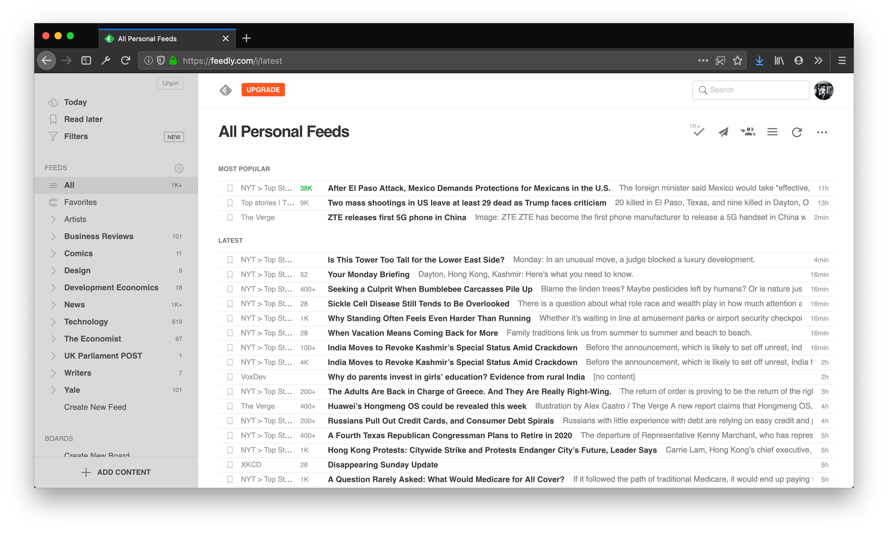

# The best RSS reader for noobs (like me)

**The best RSS reader for newcomers is [Feedly](https://feedly.com).**

With that out of the way, here’s a fuller but still brief justification of why.

[RSS](https://en.wikipedia.org/wiki/RSS) (Really Simple Syndication) feeds offer a private, relatively decentralized means of aggregating content from your favorite news sites and blogs. A raw feed ([click here](https://www.theguardian.com/world/rss) for an example from The Guardian) is typically a dump of the most recent articles by a web publisher. You can plug these feeds into a reader app of your choice.

This post is about which reader app is the best. There are no shortage of posts like these. The Sweet Setup, in particular, has a great, [in-depth review](https://thesweetsetup.com/apps/best-rss-reader-os-x/) of the best RSS app for macOS (they advocate for [Reeder 4](https://reederapp.com/)). However, after trying out their recommendations, and doing a little research of my own, I have my own criteria for what makes a good reader:

1. Fetch older data not in the current feed state
2. Free or one-time purchase (no subscription-only)
3. Folder organization
4. Reader view (aka Mercury Parser)

\#1 is the biggest criterion for me. One of the limitations of RSS is that it usually provides the most recent 10-20 articles, as set by the web developer. However, I’d like an RSS reader that can let me browse entire archives without use of a full web browser. [Google Reader](https://gcemetery.co/google-reader/) was able to do this (RIP), and so can Feedly and [Inoreader](https://www.inoreader.com/). The latter two are not just web and mobile apps, but also services that cache RSS feeds from the point they are first submitted by _any_ user.

Until “non-service” apps like Reeder can load older data, Feedly and Inoreader are the best bet. They also meet the other listed criteria. What breaks the tie between them? Although their free-tier web apps are comparable, Feedly’s iOS app is less clunky than Inoreader’s (but still not great), which gives it the edge.

Have your own favorite RSS reader? Please let me know in the comments, I'd love to try it.
