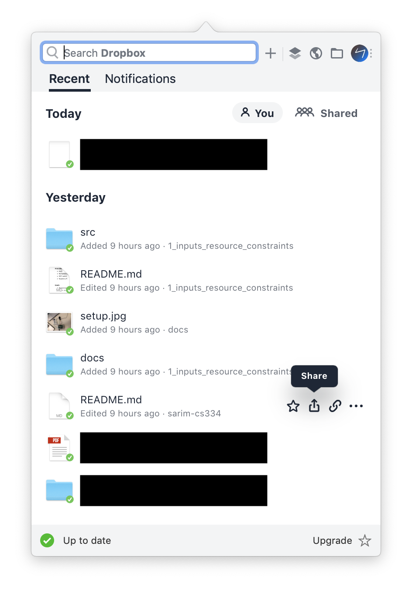

# The unified productivity application

[[toc]]

## Introduction

I am a passionate user of productivity software, loosely defined here as applications that produce and organize data such as notes, bookmarks and other file types. In this post, I want to discuss my obsession with Dropbox, a file-sync service that has taken a new turn with its redesigned desktop client. At first blush, the offering seems limited and even unrelated to other popular productivity apps. However, I would argue that it represents a promising step in the direction of a versatile app that puts users firmly in control of their diverse data.

> In this post, I am interchangeably using the words "app", "application" and "software".

## The new Dropbox

The redesigned desktop app was unveiled in June 2019. Whereas previously the Dropbox client on macOS had comprised a combination of Finder extensions (e.g. right-click to share link) and an occasionally useful menu-bar preference panel (Figure 2.1), the new app includes a Finder-like interface for managing files (Figure 1).


|                                                                          |                                                                               |
| ------------------------------------------------------------------------ | ----------------------------------------------------------------------------- |
|  |  |

[In their blog post](https://blog.dropbox.com/topics/product-tips/new-dropbox) about the new app, the company comments on how fragmented our digital lives have become, ironically split between dozens of productivity apps that promise to wrangle our data and meet deadlines. Often, more time is wasted switching between Google Docs, Airtable, Notion, Todoist and 'massaging' their data representations for interoperability and sharing.

As a solution, Dropbox has pursued integrations with other web services, promising to bring all your content and services in one place. For example, users can create shortcuts to web pages and Google Docs alongside traditional files and folders (Figure 2.2). In Dropbox's case, I believe that such integrations are extremely important for two reasons:

1. We live in an age of web apps and services. Dynamic, real-time content is often stored in a company's cloud. Dropbox refreshingly brings back the physicality of having all your data represented as files that you can move around in the operating system ([everything is a file](https://en.wikipedia.org/wiki/Everything_is_a_file)). This is also why the new app is distinct from Google's own Drive web interface, which has allowed links to Google Docs for years: Dropbox is on a course to support many more 'cloud file types' besides Docs
2. User control over their data is important. Interoperability of services is important. In an age where there are calls to 'break up' Big Tech, a more considered approach is to let users decide where and how their data is stored. Dropbox can achieve this by being a central home for all file types, including the cloud

Besides this improved file management, the app has a number of features that are reminiscent of established productivity apps (Figure 3):


1. Organization: (a) 'Spaces' for overviews of project and team activity, (b) Leave notes and assign todos
2. Communication: (a) Slack-like conversations, (b) feedback and comments on files
3. Navigation: (a) sidebar for quick access to starred folders, (b) robust search, including cloud files

## Unified productivity

I think Dropbox has taken substantial steps towards developing a unified productivity app; one that can potentially aggregate many kinds of data (notes, bookmarks, todos, cloud content _etc_.). But the app is limited in what it lets you _create_ – for that you must use other apps with which it integrates and co-exists. Want robust note-taking? You could use [Typora](https://typora.io/), a Markdown editor. A spreadsheet? Google Sheets. However, I would argue that with few improvements, Dropbox could unseat these popular tools entirely.

If you think about it, most productivity apps are just abstractions over lists of objects, stored in a predictable file structure. Bear is a note-taking app that is a pretty interface for writing `.textbundle` files. Pocket is a bookmarking app storing a list of links, along with metadata and rich previews. Even apps that _seem_ non-linear in the way they handle data are actually just smart about how they render those same lists. Seen another way, Trello's Kanban views are just vertical list items grouped horizontally.

The takeaway is that productivity apps are more homogenous than they seem. Airtable and Notion have wisened up to this idea, rendering lists in different views as it suits the user. Suddenly, the spreadsheet is also a calendar, todo list or Kanban.

|                                                |                                                      |                                                      |                                                            |
| ---------------------------------------------- | ---------------------------------------------------- | ---------------------------------------------------- | ---------------------------------------------------------- |
|  |  |  |  |

So why shouldn't Dropbox, having proven its mettle in storing our files, also help us render and create them? What might that look like? My proposed suite of productivity features rests on the introduction of a new file format, and new ways of rendering file trees.

## Chaos.app

The improvements I propose can be organized into three broad categories:

1. New container file format
2. Favor folder, not file, integrations
3. User interface changes
    1. Sidebar organization
    2. Collaboration/chat
    3. View options

Let's call our hypothetical, improved app **Chaos.app** (an ironic but fitting name that implies that this app will help us wrangle the chaos of our digital lives).

### New container file format

The first idea takes inspiration from Dropbox's 'cloud files' that link to web app content. I believe this can be taken much further. The reality is that there are hundreds of popular web apps, with many more picking up traction every other month. No company, including Dropbox, should have to develop countless integrations and proprietary file formats to view this content. Instead, I propose an open-source, community-driven, container file format developed specifically for the web. Lets call this format `.CHRNCL`.

There are no good mechanisms today to save content from the web. We may take screenshots, save a PDF, or use a browser-specific file format like `.webloc`. We have bookmarks and read-it-later services like Pocket but these are links (not single files) that are stored in proprietary clouds.

`.CHRNCL` is a container format (similar to `.textbundle`) that would support a variety of use-cases. At a minimum, it would store HTML/CSS assets and metadata about the saved URL. In addition, community-built modules would save and render the file appropriately for the user, depending on the website. An Article module could replace Pocket and show a simplified reader view of the webpage, while a Video module could open up a local stream to the video host. A Spreadsheet module could be a streamlined wrapper around a Google Sheet, while an RSS module could open an interactive feed of your favorite blog. All of this without having to open up a web-browser, authenticate and navigate within the respective web apps' interfaces. Just imagine:

<iframe width="560" height="315" src="https://www.youtube-nocookie.com/embed/6aXFKjmZ_SI?rel=0" frameborder="0" allow="accelerometer; autoplay; encrypted-media; gyroscope; picture-in-picture" allowfullscreen></iframe>

&nbsp;

`.CHRNCL` would bring the web content we care about into the realm of the file system.

### Folder, not file, integrations

Our new productivity app no longer needs proprietary integrations for "cloud files", since the `.CHRNCL` file format already achieves that in an open-source, community-powered fashion. Where the revamped app could really shine is with cloud integrations - specifically automation - at the folder level.

```
Dropbox
    - my-team
        - design
            - branding
            - UI
        - blog
            - posts
            - assets
```

With Zapier or IFTTT, one could conceivably push design assets to clients automatically, or share all future blog posts to Netlify, amongst countless other integrations. Chaos.app would be the source of truth for many of a team/project's operations.

### User interface changes

The third part of the equation is modifying Dropbox's interface to better abstract over file trees, including the new file format `.CHRNCL`. In my mind, Chaos.app would bring together the best features from aforementioned popular apps, but in a harmonious fashion. Here's what this might look like:


I'll elaborate on the individual features below.

#### Sidebar organization

> How will navigation work?

Drilling through folders in the new Dropbox is as unpleasant an experience as in Finder. Ideally, I'd like to have a hierarchical overview of my file tree. Bear is a great example of this organization, and uses infinitely nested tags. Clicking a parent tag recursively populates the list view with all notes belonging to descendant children. In my personal experience, this approach drastically reduces the cognitive load associated with remembering folder paths and clicking through Finder. The Dropbox sidebar, currently limited, could be revamped with this approach.

<iframe width="560" height="315" src="https://www.youtube-nocookie.com/embed/aKf2DGvRT_4?rel=0" frameborder="0" allow="accelerometer; autoplay; encrypted-media; gyroscope; picture-in-picture" allowfullscreen></iframe>

#### Collaboration/chat

> How will team communication work?

The most popular, purpose-built app for team communication (as of writing) is Slack. For all its strengths, it has room for improvement in two areas:

1. Poor channel organization: Medium to large teams struggle to capture the complexity of their operations across hundreds of channels. Sometimes, one-off channels are created for specific tasks. Channels are also not sufficiently discoverable, especially by new team members. Slack has an entire page dedicated to [advice for large teams](https://slackhq.com/advice-for-large-teams-on-slack). But perhaps they should question their own fundamental design and architectural assumptions
2. Not tied to files: Files live inside a chaotic chat history and are difficult to find and search for. Files _augment_ the chat, they are _not_ front and center. Case in point: a designer trying to assemble and share a branding package will find Slack unsuitable – the chats are just too ephemeral

How can we address the above concerns? The surprisingly simple solution is to **tie the chat to the file tree**. Each folder level in the file tree (what you would call a "tag" in Bear) can be its own chat channel. As users click through the tree, their chat window recursively displays messages for the current level and its descendants. The greatest benefit of this approach is that users can have as high-level or fine-grained a conversation as they like. For example, a CEO of a large company can peer into the chaos at the highest level, and visit lower branches to see how individual teams in the organization are doing.

|                                                         |                                                         |
| ------------------------------------------------------- | ------------------------------------------------------- |
|  |  |

#### Folder view options

> When you click a level of the file tree, what should you see?

The obvious first choices are a list view and a grid view, with appropriate filtering and sorting options like _Date_, _File Size_ _etc_. But are there ways to attain feature parity with other productivity tools without much more engineering effort? Yes, if the user is allowed to attach (1) unique "labels" and (2) deadlines to each file. This information could be stored as metadata in a SQLite database at the root level. These two additions would support two other view options:

1. Kanban view: Each label corresponds to its own column. This can replace Kanban apps like Trello.
2. Sort by deadline and completion of tasks: This can replace todo productivity apps like Things and Todoist.

<iframe width="560" height="315" src="https://www.youtube-nocookie.com/embed/Y4C5jEPcNbs?rel=0" frameborder="0" allow="accelerometer; autoplay; encrypted-media; gyroscope; picture-in-picture" allowfullscreen></iframe>

#### File view options

> When you click a file, what should you see?

If it's a regular file, you should see the Quick Look preview, same as Finder. And if it's a `.CHRNCL` file, Chaos.app retrieves the correct community-built module to render a preview.

## Conclusion

I am quite optimistic about Dropbox's current efforts to unify our digital lives. However, limitations within their software prevent them from unseating the plethora of popular and niche productivity tools, which in reality are quite similar in their architecture. I have hypothesized an app, dubbed Chaos.app, that extends Dropbox's functionalty by embracing principles of open-source, modularity, extensibility and portability. With these improvements, Dropbox could evolve from a file-manager to a dominant, unified productivity app.
