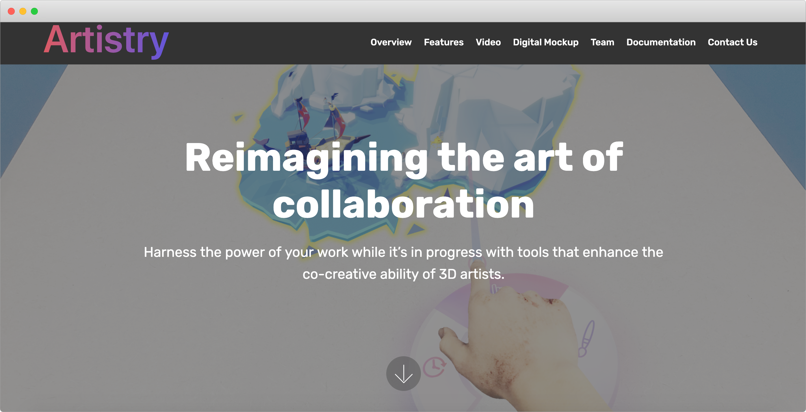
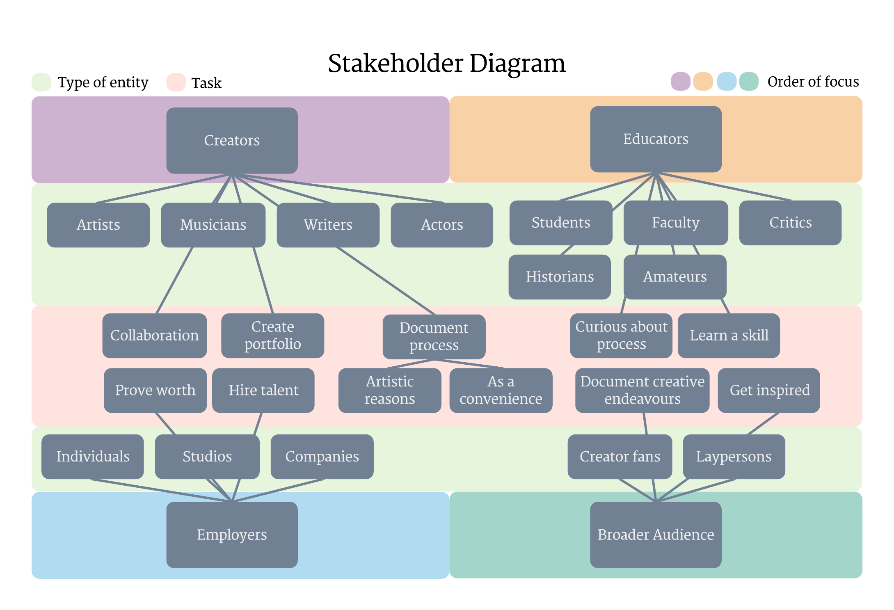
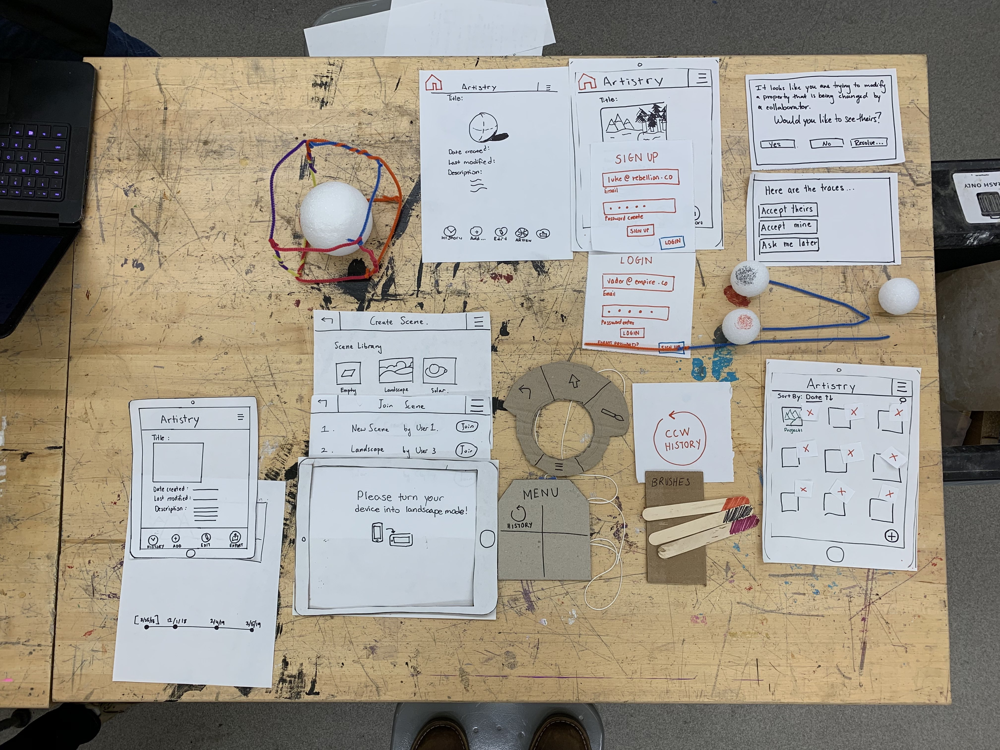
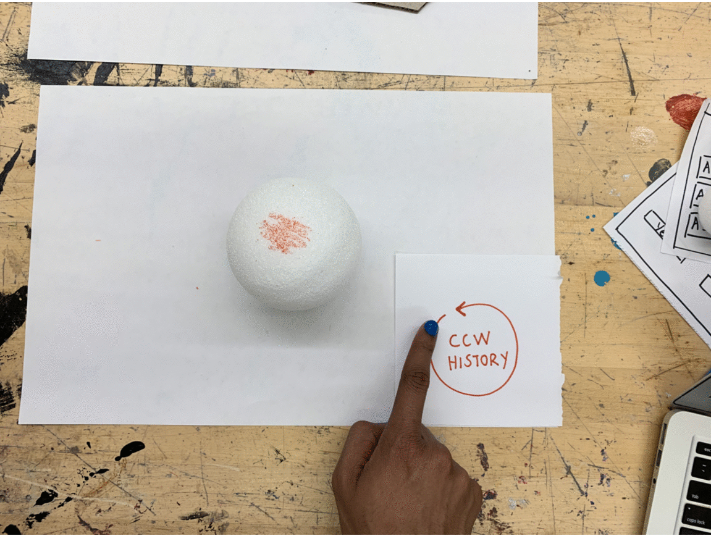
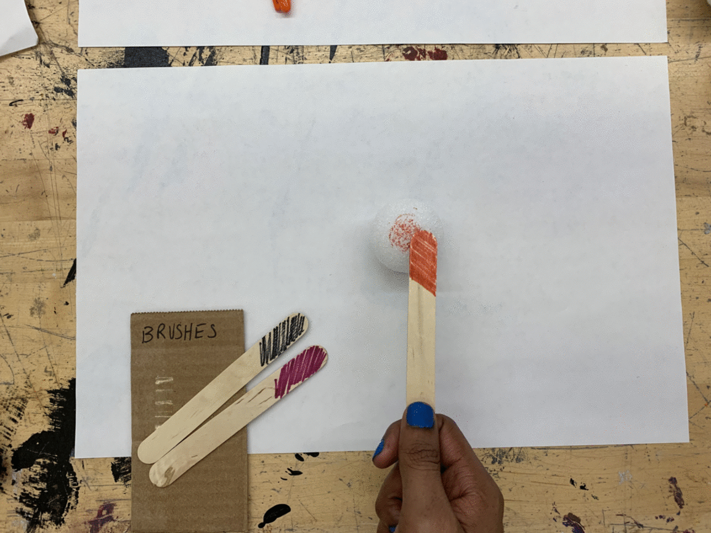
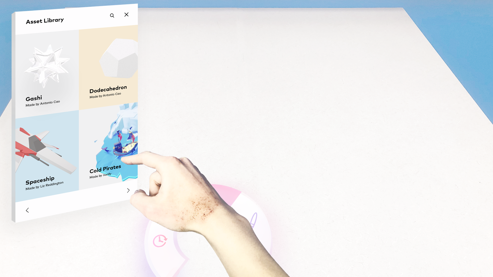

# Artistry

<a style="all:unset" href="https://sarimabbas.github.io/cs429-artistry/" target="_blank" rel="noopener noreferrer"><button class="button">Visit Artistry</button></a>

[[toc]]

## Overview

Much of an artist’s journey is unreadable and therefore unrecognizable to a consumer or critic. How can we empower artists to represent the evolution of their work? Many artists write in journals, take process photos, write essays etc. The purpose of these projects is either to provide the necessary context to consumers, or for artists to clarify their process to themselves. But these projects can take up a significant amount of mindshare or even morph into full works in their own right. A related problem is of collaboration. Artists have different processes, inspirations and styles. How can we enable artists to work together in the creation process?

This was the focus of my team's project for the [Introduction to Human-Computer Interaction](https://cpsc429-hci.gitlab.io/s19/) (HCI) course at Yale University. We mocked a mobile app that lets users collect ideas, collaborate and engage with a community. We also developed a concept for 3D artists (e.g. sculptors, animators) in particular to collaborate in a VR environment. The full report for this project can be found on the project website [here](https://sarimabbas.github.io/cs429-artistry/).

## Research process

### Goals

Though we felt an eventual product could benefit a number of stakeholders (who, in my mind, are organized as below), we narrowed our scope to creators, who we believed the more important group in the art world to cater to.

Before we could address the documentation/collaboration problem with a specific solution, we conducted research with the aim of understanding how artists:

- Create and document their works
- Collect inspiration and ideas
- Gather feedback and respond to critique
- Deal with frustrations in their daily workflows

### Methods

Our research methods were threefold:

- Contextual inquiry: A short interview followed by observation of users attempting tasks in their natural environments. The hope is that users will reveal subconscious, tacit knowledge
- Fly on the wall: Passive and unannounced observation of users in varied environments such as libraries and art studios
- Formal interviews: 15-20 minute coffee talks with a pre-prepared set of questions

Our subjects included painters, sculptors, photographers and musicians.

### Findings

We organized our findings into several themes as follows:

- Collaboration: Working with others  on projects can be difficult because of scheduling conflicts, unclear accountability, limited resources and miscommunication
- Content creation: An non-specialist artist complained about Adobe Illustrator's difficulty. Many wished to automate laborious layout and alignment processes
- Ideation: Several interviewees wished for a more efficient way to explore a design space. One suggested creating a tool to help designers permutate many possible ideas
- Presentation: Many digital artists would rather take screenshots than go through the cumbersome process of exporting from design software. In a similar vein, assembling a portfolio was thought to be a chore
- Sketching: Many designs start sketches on a piece of paper. Art professors routinely emphasize that physical, tactile interactions with one’s design are tremendously instructive. That experience is not yet digitally replicable
- Designer-developer handoff: For those working in interdisciplinary teams or startup environments, communicating designs can be difficult. For instance, most tools do not have options to export code for developers

## Tasks

Our research helped us prioritize two tasks that we felt any viable product/solution had to address:

1. Mobile, collaborative creation: Inspiration can strike anywhere, and with anyone. Artists should be able harness existing portable devices to create works
2. Document process: Artists should be able document work for their clients or themselves with minimal added cognitive load

## Prototype

With these tasks in mind, we built a mobile app as a paper prototype. Using paper let us explore ideas freely and rapidly. The app lets artists post their works, create new ones using a suite of tools, work collaboratively, and solicit feedback.

Around this time, we also thought of how we might serve an often overlooked subgroup: 3D artists. For decades, sculptors, animators, game designers and more have been using the same 2D desktop software to build complex 3D environments. We could integrate the handheld VR tech behind Google Cardboard with our mobile app to open up a new realm of possibilities for 3D artists. For instance, here is what an _undo_ interaction might look like:

## Testing

With the prototype complete, we conducted [usability tests](https://www.nngroup.com/courses/usability-testing/?lm=usability-101-introduction-to-usability&pt=article) to find and fix flaws in our hybrid interface. We assigned artists two tasks.

1. Within our mobile app, we asked them to:
   - Rewind the history of a work
   - Create a shared workspace
   - Sketch using a paint brush
   - Transition to the VR environment
2. Within the VR environment, we asked them to:
   - Model a sphere
   - Work in tandem with another "user" (interviewer)

We swapped paper modules as the interaction went on, and periodically asked users about their rationale for an action. The testing revealed a number of flaws in the interface, including undo of destructive actions, selection of elements, and crucially, handling collaboration conflicts. The latter required thought: live collaboration conflicts are simple enough to reason about in Google Docs, but how should the actions of artists compose in an environment of pixels and voxels? We felt we had an answer in Github's graph model, that lets developers branch and merge. Our refined prototype adopted something similar:

## Mockup

The final app mockup was created in Adobe XD. It can be browsed below:

<iframe width="100%" height="500px" src="https://xd.adobe.com/embed/a2e870a5-adc9-4627-49d2-d0e091cff9b1-d4d9/" frameborder="0" allowfullscreen></iframe>

After an orientation and sign-in, the user is shown a list of their projects. These projects can be created from existing media assets, from remixing others' work, or from scratch with the suite of creative tools. The _Explore_ tab lets users follow others for inspiration. The project view lets users share feedback, chart the progress of a work with a _History_ function, and step into the optional VR mode, the concept for which is below:

## Acknowledgements

Many thanks to my teammates Kenyon Duncan, Antonio Cao and TanTan Wang, and Intro HCI's Professor Marynel Vázquez.
