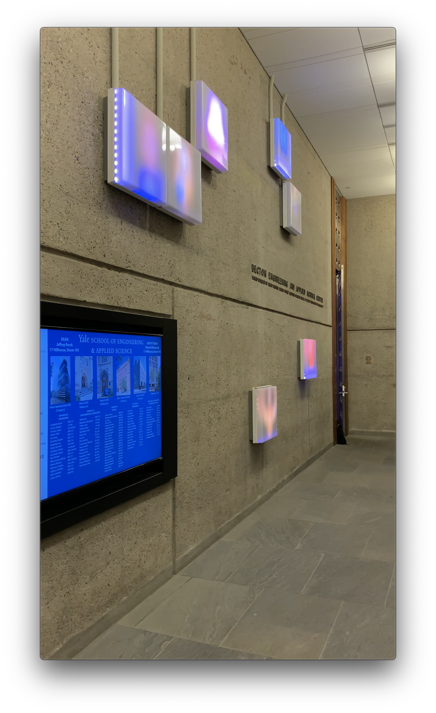
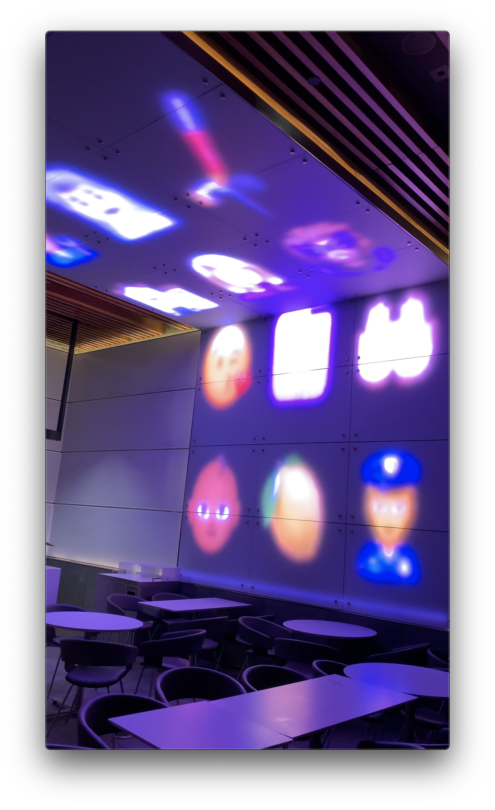

# Generative Emoji Art

<YouTube src="https://www.youtube.com/embed/qkOxWb4VdMY"/>

 

<YouTube src="https://www.youtube.com/embed/XrZdSIVRjIU"/>

## Table of Contents

- [Generative Emoji Art](#generative-emoji-art)
  - [Table of Contents](#table-of-contents)
  - [Creative Vision](#creative-vision)
  - [Challenges](#challenges)
    - [Emoji support](#emoji-support)
    - [Parallel draw animations](#parallel-draw-animations)

## Creative Vision

I had a number of objectives:

- The art would try to start a dialogue with the viewer
- My art would be specific to the layout of the Becton, and would utilize each panel as a discrete pixel space
- The outer panels would try to draw visitors towards the inside of the cafe

For the first objective, I took inspiration from the ways in which we communicate with each over the Internet: GIFs, memes and emoji. These have brought new meaning and emotion into our conversations. For instance, take this string of emoji: "🚫😢🍼💦". It could be taken to mean: "Don't cry over spilled milk". Emoji combinations like these can convey potentially deep meaning, but also remain playfully ambiguous.

I thought about how I could populate the Becton LED panels with these emoji, in a way that I could also accomplish my other objectives. My `generator` program renders patterns of random emoji that are open to interpretation by the viewer.

There are 15 LED panels in the outer space. I configured them to show splashes of color from random emoji. These "deconstructed" emoji are interesting enough to warrant closer inspection, but due to the low resolution of the panels, their distinguishing features cannot be resolved. So the visitor may be drawn to the cafe, where the emoji are being randomized in unison.

Inside the cafe, there are 3 columns of 4 emoji each that take up the entire screen space. I found that to be the optimal size for 1) showing image detail and 2) giving the impression that there are "sentences" formed by the emoji. It is up to the viewer to interpret sentences by column or row.

## Challenges

I was mainly limited by the capabilities of Processing and the computer's resource constraints.

### Emoji support

I intended to use Unicode codepoints for the emoji, but Processing's support for these is quite poor, and online documentation is limited. It is possible to download open source fonts (such as `OpenSansEmoji.ttf`), but these only provide access to black-and-white emoji. Using the full color Apple emoji found on macOS was not possible. In addition, emoji designs vary across operating systems, so I needed to maintain a consistent design when porting to the Raspberry Pi anyway. So I used a Ruby tool called [Emoji Extractor](https://github.com/tmm1/emoji-extractor) to extract roughly 2000 160x160 images from the macOS emoji font file.

I was initially worried that 160x160 was too small for the inner display (although it worked out fine), so I tried to download an SVG emoji pack from Twitter as an alternative. Unfortunately, Processing has poor support for importing SVGs that are not minified in a certain format, so it would randomly crash.

### Parallel draw animations

I had to enforce a delay of 5 seconds before the next set of emoji are loaded into memory. This delay prevents me from adding parallel animations. For instance, I wanted to translate the 3 emoji columns in opposing directions to show dynamism and motion. One solution I tried was a Processing `thread` in an infinite loop that continually modified some shared state. But the result was glitchy and not smooth, so I reverted.
