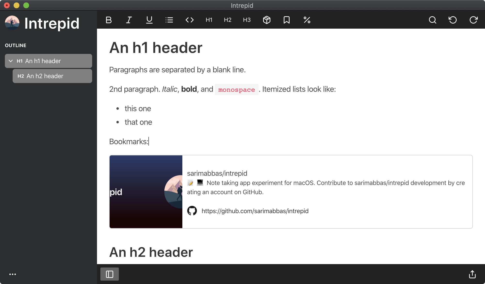

# Intrepid

Note-taking app for macOS

<Button href="https://github.com/sarimabbas/intrepid/releases/latest" external="true">Download latest release</Button>

<Button href="https://github.com/sarimabbas/intrepid" external="true">View source code</Button>

## Goals

I've been looking for an [effective way to take notes for some time](https://sarimabbas.com/posts/2019/markdown-editor/). I am drawn to the simplicity of Markdown-like syntax for note-taking, however I have my reservations about apps that keep my notes in siloes and sync them with their servers. I much prefer having complete ownership of my data, in the form of files that I can sync with a provider of my choice. My second gripe with existing editors is their lack of features in the context of web app data. [Note-taking apps should synthesize our digital lives](https://sarimabbas.com/posts/2019/unified-productivity/), but they're usually only good for a particular file format. I intend to make this editor customizable and versatile enough that it can handle storage, organization and preview of diverse data.

## Features

- Markdown WYSIWYG
- Images (embedded or file links)
- Bundle file format
- Syntax highlighting
- Outline panel
- Embeds
- Bookmarks/previews
- KaTeX (limited)

### Images

#### Local images

One of the core principles behind Intrepid is that your data must be portable. For a new, unsaved file, pasted or dropped images are embedded as Base64 encoded strings. When the file is saved, these images are extracted to an assets folder inside your file. From then on, all new images are added to the assets folder.

#### Remote images

Use the Markdown image syntax. All these links will remain unchanged.

### Embeds

Paste in a URL from any of the services below and click the Embed button in the toolbar.

- YouTube
- Vimeo

Recommend a service (that is ideally embedded via Iframe) by opening an issue.

### Bookmarks

Paste in a URL from anywhere and click the Bookmark button in the toolbar. You will see a detailed preview of the link.

### KaTeX

Write a plain-text math expression and click the KaTeX button in the toolbar. The math will be rendered. Interactive editing is planned.
