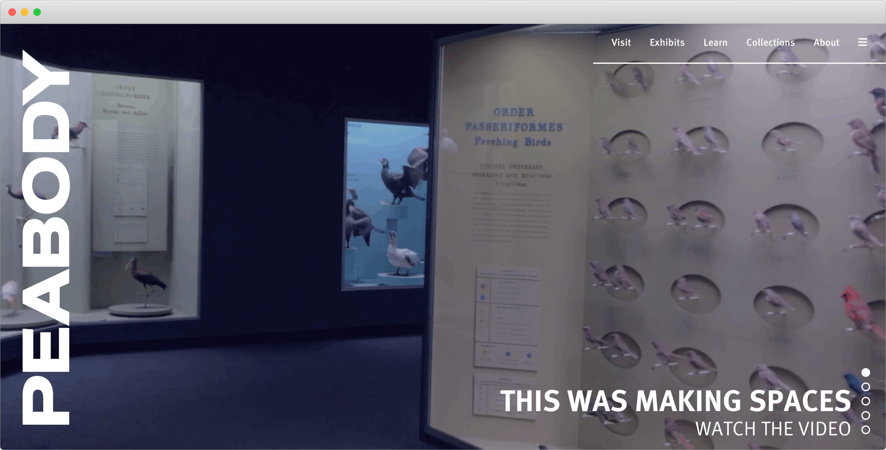

# Peabody Spaces

<a style="all:unset" href="https://enas410-96ed4.firebaseapp.com/" target="_blank" rel="noopener noreferrer"><button class="button">Visit Peabody Spaces</button></a>

[[toc]]

## Overview

This redesigned website was created for the design course, Making Spaces, offered at Yale University. My role was that of chief developer. The Peabody Museum of Natural History is [undergoing a major renovation](https://peabodyevolved.yale.edu/), the first in nearly a hundred years. My team was tasked with developing a refreshed, hypothetical visual identity and web presence that would convey an appreciation of tradition, while signalling the museum's step into the future.

## Research process

The course was as much about inculcating a sense of wonder about the Peabody Museum's history and expertise as it was about making recommendations for its future. Nearly a dozen trips to collections (including vertebrate and invertebrate paleontology and zoology), and presentations by Peabody staff and associates about investments, conservation and restoration impressed on us the scale of the Peabody's initiatives. Once our team was tasked with developing a new digital presence, we combined our conversations with Peabody staff with research on nearly 50 different museums in the space, and countless other approaches to digital exhibit curation. The result was a well-received website and identity presented to the staff in our final presentation.

## Website

The website was designed to inform and engage all Peabody patrons. It fully incorporates the visual identity. The website is built from scratch in HTML/CSS and React, and deployed on Firebase. The website is fully responsive, and optimized for mobile. Following are some of the core features that add touches of magic to the pages.

### Hero slider

When first accessing the website, the visitor is struck with the large video that occupies a 100% of the viewport height. The frames were extracted from the final course video, a separate project. Controls on the bottom right let the user flip through prominent content dispersed throughout the site. Thus the hero slider provides an impressive overview of the Peabody's many arms.

<video src="./assets/hero.mp4" controls></video>

### Comprehensive menu

After much deliberation about how to present information about an entity as complex as the Peabody, we took a page from the [Hirshhorn Museum's](https://hirshhorn.si.edu/) book, and decided to keep the initially visible menu simple, with five broad categories. Once the hamburger is clicked, a full screen menu provides a more detailed organization of the website's pages. This combination allows for both quick navigation to major sections, and more comprehensive navigation to specific pages with only an extra click.

<video src="./assets/menu.mp4" controls></video>

### Variable width font

One of the most eye-catching elements on the homepage is the sideways word mark. Taking inspiration from the playful and protean nature of the [Whitney Museum's](https://whitney.org/) mark, the logo uses a variable width font that adapts to the user's scroll. We wanted to show, too, that the Peabody Museum was adapting in response to visitor needs. A scroll event listener updates the width in real-time, creating a memorable effect. The mark is localized to the hero slider area using a combination of sticky and absolute CSS positioning.

<video src="./assets/variable-font.mp4" controls></video>

### Interactive floor plan

The educational potential of a museum's collection should not be realized through live visits alone. For those who cannot visit the Peabody, or those planning their trips in advance, an interactive floor plan or map would be very valuable. We had two routes we could take when building ours. We could opt for a "Street View"-esque tour like the [Smithsonian's](https://naturalhistory2.si.edu/vt3/NMNH/z_NMNH-016.html), which would have required 360° cameras placed in each museum room. Instead, we drew inspiration from the simplicity and extensibility of [The Met's](https://maps.metmuseum.org/) 2D map. Consequently, our floor plan is a faithful 2D reconstruction of actual Peabody plans. The images were first traced in Adobe Illustrator by Kevin Koste, and exported to SVG. The SVG format is amenable to JavaScript event handlers, that allow for hover and click interactions. The plan allows side-by-side view of exhibit photos and information.

<video src="./assets/floor-plan.mp4" controls></video>

## Visual identity

The visual identity was created by [Julia Ma](https://juliacma.com). The shape of the logo is an abstracted version of the Weston Meteorite, first described by Yale professor Benjamin Silliman after it fell over Connecticut in the 1800s. The ten sections of the icon represent the ten divisions of the museum, calling attention to the collections' diversity. Julia also proposed a color palette and typography scheme that underpinned the website's development.

## Acknowledgments

Many thanks to my teammates: Julia Ma, Kevin Koste, Rebecca Reza and Seamus Houlihan; the teaching staff of Making Spaces: Dr. Joseph Zinter, Ashlyn Oakes and Kristoffer Ala-Ketola; and the staff of the Peabody Museum.
