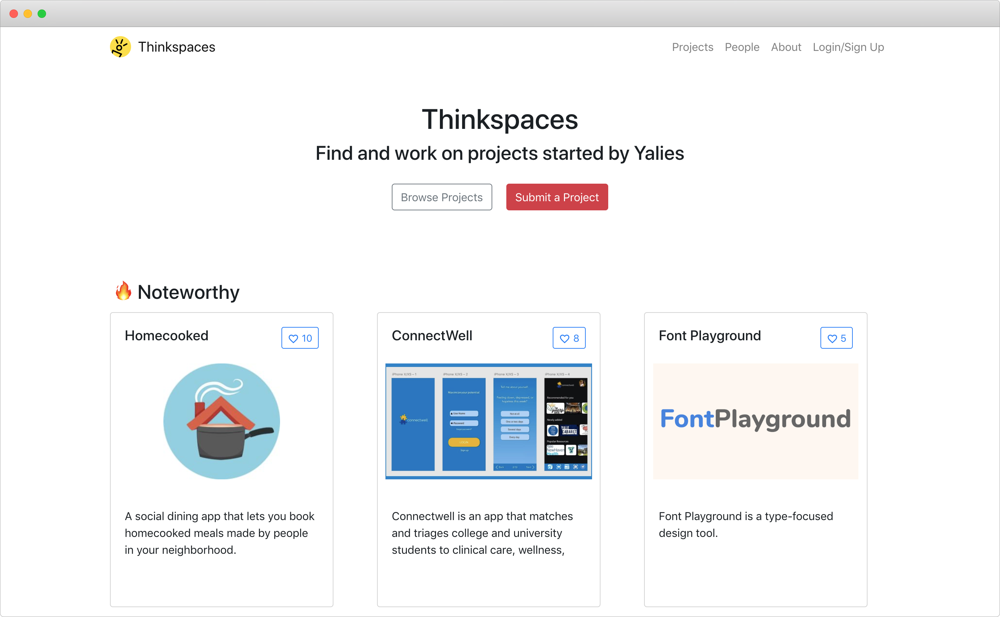

# Thinkspaces

Web platform to discover creative opportunities

<Button href="https://thinkspaces.org" external="true">Visit Thinkspaces</Button>

[[toc]]

## Overview

Thinkspaces is a web platform for students to discover meaningful, creative opportunities. These can range from a student-led project to a position in a research lab, a job at a promising startup to a more mature position at an established company.

Thinkspaces started one evening as my co-founder and I discussed starry-eyed ideas over dinner. We quickly realized we had limited technical experience to realize ambitions that would've required use of the latest hip web framework, or blockchain/AI porridge. Even worse, there were few effective avenues to tap the talented Yalies that did. This is not an unknown problem: hundreds of hobby, club and job recruitment emails get buried in inboxes everyday. Posts on Facebook get swept away in infinity feeds. Paradoxically, despite being bombarded with information, it remains difficult to find reliable opportunities for personal and professional growth. So we devised an idea to mitigate this problem — Thinkspaces.

## Needs

We conducted nearly 50 live interviews (and counting) with undergraduates, graduates, faculty, administrators, club leaders, entrepreneurs and more. We received many more opinions online in response to emails and surveys we circulated to rouse interest. Our research revealed a number of user segments:

1. Independent project owners: Their class or hobby projects are often shelved when, instead, like-minded enthusiasts could have banded and taken them further.

2. Administrators: They receive many requests for supporting new student initiatives. One request notoriously difficult to assist with is building a team. Admin often plays middle-man to bring talented minds together, but lacks a systematic, self-sustaining means of doing so.

3. Club leaders: Whether a newspaper, dance club or engineering society, all clubs seek to expand their membership, meet project deadlines and raise money.

4. Budding professionals: These students desire relevant work experience to pad their resumes, and prepare them for a life in industry.

5. Companies: Research labs, startups and established companies are eager to recruit students, sponsor events and introduce their technology.

6. Searching: [FOMO](https://en.wikipedia.org/wiki/Fear_of_missing_out) and the need for building connections motivates this group of people.

## Solution

The currently deployed Thinkspaces has a no-nonsense feature set. Anyone can post any opportunity (project, job etc.). Interested users filter to find it or be notified. Introductory messages are sent and then they're off to the races. Moreover, users can build strong profiles to let opportunities find them instead.

What's in the works is a reputation system to separate the wheat from the chaff, and to reward interactions (think Stack Overflow) that build a tight-knit community; of geeks, hackers, artists and entrepreneurs. We want Thinkspaces to be more than a notice-board, we want it to be the place where meaningful work gets found and completed.

The first version of Thinkspaces catered strongly to segments #1-3. We believed our competitive advantage lay in a marketplace of ideas and talent fuelled by student projects. After all, LinkedIn, AngelList and assorted job boards already cater to the professional environment #4-5. After receiving feedback from mentors, we realized we could adapt our model to provide the traditional, resume-boosting opportunities that many students desire. But we're taking pains to ensure that this does not dilute the creative spirit of the community _we_ desire. Whether this means a dedicated section for jobs or a unified search with stylistic differences (as it is now) is still in debate.

## Technology

Since we're students, Thinkspaces has been a guinea pig for many technical experiments. The technology behind it has changed multiple times while we have grown as computer scientists. As intrepid, inexperienced sophomores, we first built Thinkspaces with Flask, the Python microframework, which we shelved because it did not give us the real-time flexibility we knew we'd need in the future. We ultimately decided on React, not least because of its ecosystem of packages and ease of deployment to Firebase.

Still in its nascent stages, the codebase of Thinkspaces changes appreciably week to week, as we incorporate functional programming best practices, refactor code, introduce new features and get into a rhythm. Many exciting new developments are planned!

## Usage and achievements

-   Thinkspaces has 200+ registered users, and 50+ projects.
-   Its expansion beyond Yale University has resulted in projects from UConn, Harvard and the wider New Haven community.
-   It was accepted into Yale's Tsai CITY Accelerator, a program with an ostensibly low, _low_ acceptance rate.
