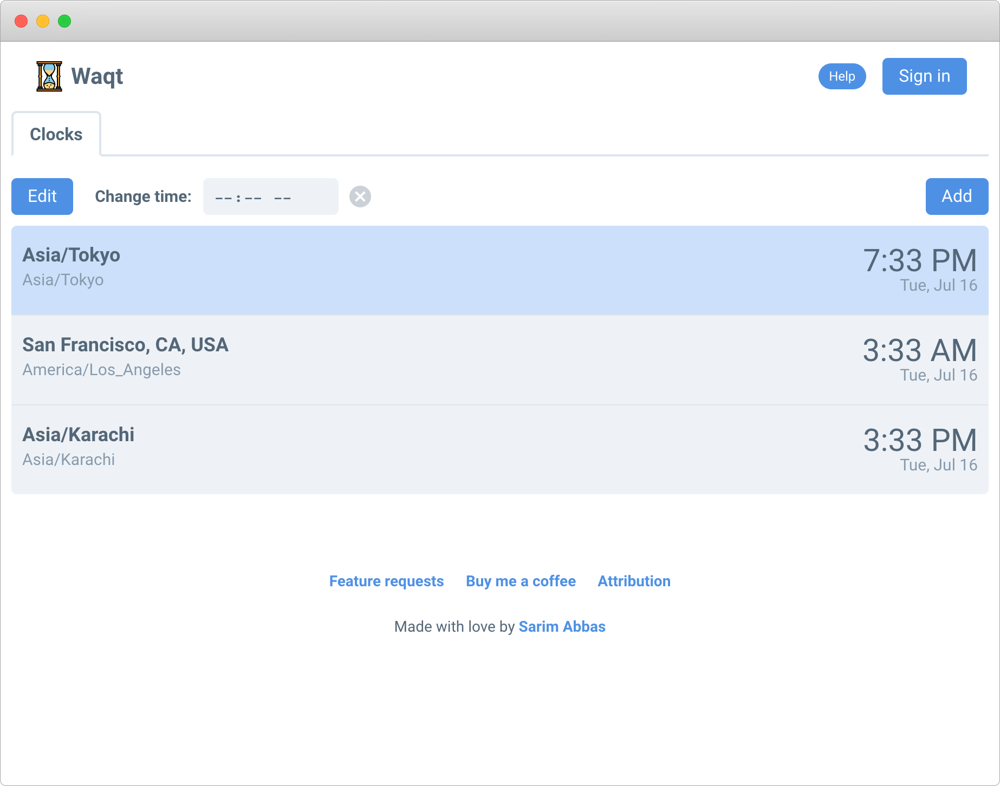
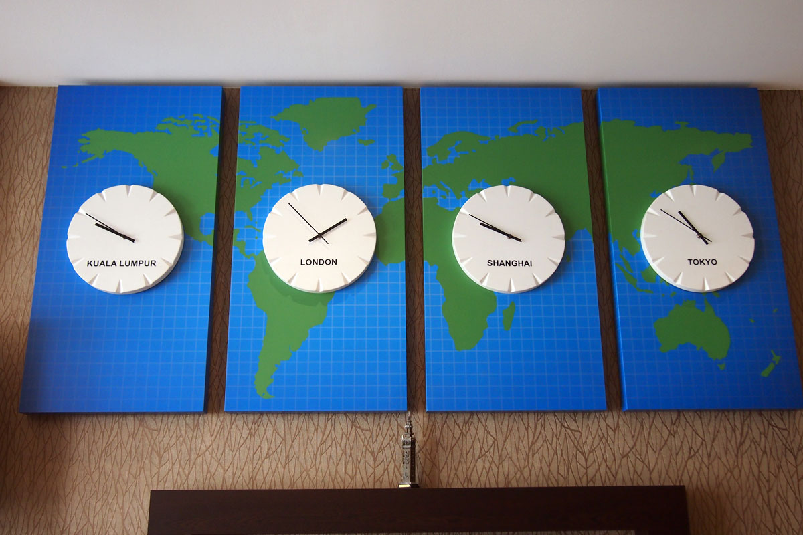
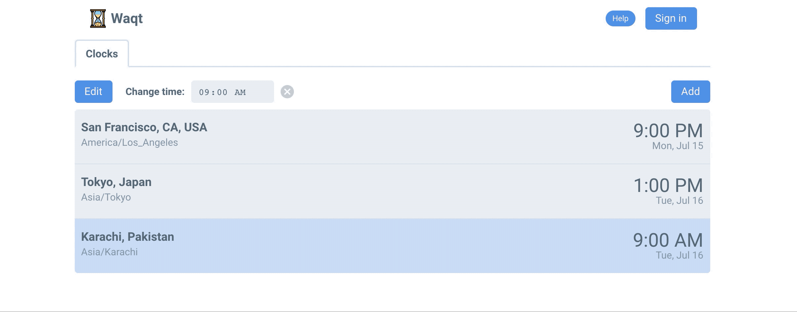

# Waqt



<a style="all:unset" href="https://waqt.app" target="_blank" rel="noopener noreferrer"><button class="button">Visit Waqt</button></a>

[[toc]]

## Overview

Waqt, named after the Urdu word for time, was born out of a need to keep up with family and friends in different timezones. Converting between timezones is tricky enough for two parties, and it becomes much worse when dealing with distributed remote teams. Waqt takes inspiration from the wall clocks in hotel lobbies to provide you an overview of selected timezones:



That's nothing new - many apps, including iOS' Clock, let you add world timezones. However, the distinguishing feature of Waqt is the ability to change time, and see a synchronized result. Imagine being able to turn the hands of one clock in a hotel lobby and have the others match the change. That's the core proposition of Waqt.



This makes planning meetings and calls far easier. If you plan to have a meeting, say, in Karachi at 5 PM, then you'll be able to see at a glance how that matches up with colleagues in San Francisco, or Tokyo. And if it's too late for some, you can bump up or down time in increments until optimal.

## Technology

Waqt is built with React, a JavaScript framework, and hosted on Firebase.

The component organization is fairly simple:

```text
- App
    - Clocks list
        - Add/remove controls
        - Clock
```

Initially, the state management was straightforward enough that no advanced solution like Redux was required. The only aspect that warranted any kind of global state was the "central clock" - a [Luxon/Moment.js](https://moment.github.io/luxon/) entity that would be the heartbeat for all other clocks. Even then, simple prop-drilling would suffice.

However, as new features were added, including authentication and storage of user preferences, as well as in preparation for future goals (below), a state management solution was needed. Since this was a fun, experimental project, three state management solutions were tried: Redux, Context API and [React Easy State](https://github.com/solkimicreb/react-easy-state). All three worked well, however the first and second introduced too much boilerplate. The third provided the right combination of flexibility and easy-of-use. Since Easy State does not prescribe any functional best practices, I was disciplined in how I managed my stores.

In terms of styling, the first version of the website was put together with custom CSS and a clock fashioned after [this tutorial from CSS Animations](https://cssanimation.rocks/clocks/). In a later iteration, the [siimple CSS framework](https://www.siimple.xyz/) was used for a cohesive design.

Lastly, Waqt relies on the [Google Maps JavaScript API](https://developers.google.com/maps/documentation/javascript/tutorial) to search for places when adding a new timezone.

## Future goals

Although Waqt currently has a specific function, the infrastructure is in place to pursue more ambitious goals. For instance, the teams I have worked with (including the distributed [Thinkspaces](/projects/thinkspaces)) lament a lack of intuitive technology to poll for meetings. The well-known players in this space are _WhenIsGood_ and _Doodle_, however, constructing and maintaining these polls is tedious for all involved.

Waqt could bring together several features to be the one place for scheduling meetings and events. A "Teams" tab would list all groups the user is a part of. Each member of a team would set their primary timezone. Then, when someone is scheduling an event, they would see an overview of all their team members' timezones. Waqt would even provide helpful tips about when a scheduled time is too early or late for any member. In addition, a Google Calendar integration would provide suitable free time slots that work for everyone. Once an event is scheduled, it would appear in the user's "Events" tab where they would RSVP.

## Usage and press

- Waqt hit ~6000 peak monthly users.
- It was ranked [#5 Product of the Day on Product Hunt](https://www.producthunt.com/posts/waqt).
- It was featured in a [Lifehacker post heralding the new year](https://lifehacker.com/say-happy-new-year-to-friends-in-different-time-zones-1831399687).
- And in Gigazine [here](https://gigazine.net/gsc_news/en/20190106-waqt/).